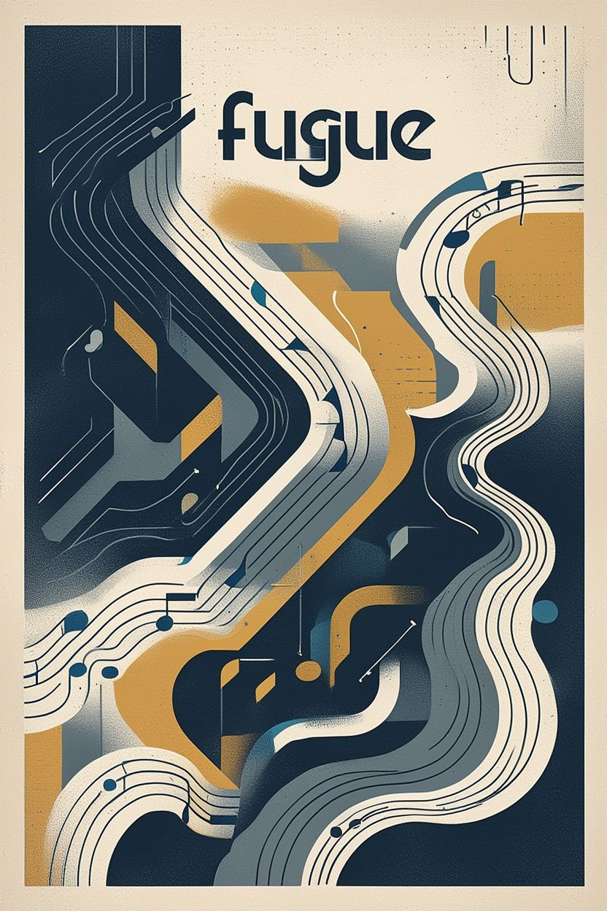

# **Fugue Orchestration Method**  

<div style="text-align: center;">
  
</div>

The **Fugue Orchestration Method** is a governance‑first, persona‑driven methodology for building **deterministic, auditable, and reproducible AI‑assisted software systems**.

Fugue provides:

- a metadata‑driven, six‑phase lifecycle  
- strict persona isolation  
- governed architectural formalisation  
- deterministic implementation and replay  
- evaluator‑driven correctness enforcement  
- reconciliation and drift classification  
- governed documentation envelopes  
- durable artefacts for long‑term lineage  
- a category‑based namespace model for all artefacts  
- a governance hierarchy of **Projects → Branches → Themes → Tranches → Tickets**  

This repository contains the **authoritative specification** of the Fugue Methodology (v2.4).

---

# ⭐ 1. Start Here

If you are new to Fugue, begin with:

### **1. [New Contributors Guide](docs/new-contributors-guide.md)**  
A complete onboarding guide covering personas, lifecycle, metadata, namespaces, and safe execution.

### **2. [Methodology Overview](docs/methodology-overview.md)**  

A high‑level explanation of the v2.4 method, lifecycle, governance hierarchy, and DECOR model.

### **3. [Persona Instructions](personas/conceptual/)**  
`/personas/conceptual/*`  
Defines the conceptual cognitive boundaries of Architect, Conductor, Curator, and Methodologist.

### **4. [Practical Execution Personas](personas/practical/)**  
`/personas/practical/*`  
Defines Initiator, Orchestrator, Implementer, Auditor, and Verifier.

### **5. [Fugue Glossary](docs/fugue-glossary.md)**  
Canonical terminology for governance, lifecycle, DECOR, personas, and artefact naming.

### **6. [Solo Developer Quickstart](docs/solo-developer-quickstart.md)**  
The fastest entry point if you want to try Fugue end-to-end without a full team setup.

### **7. [Starting a Fugue Project](docs/guides/starting-a-fugue-project.md)**  
Practical setup guidance for creating a new Fugue-governed project structure.

### **8. [Contract Suite Index](contracts/contract-suite-index.md)**  
The reference index for the methodology's governed contract set.

These surfaces provide the core conceptual foundation, role guidance, and reference entry points for working inside Fugue.

## Quick Paths by Audience

- **[For CTOs](docs/fugue-for-ctos.md)**
- **[For Directors and Heads of Engineering](docs/fugue-for-directors-and-heads-of-engineering.md)**
- **[For Engineering Managers](docs/fugue-for-engineering-managers.md)**
- **[For Solo Developers](docs/fugue-for-solo-developers.md)**
- **[When Not to Use Fugue](docs/when-not-to-use-fugue.md)**

---

# ⭐ 2. Purpose of This Repository

This repository contains the **Fugue Methodology itself**:

- methodology‑level contracts  
- conceptual and practical persona instructions  
- lifecycle workflows  
- governed templates  
- schemas  
- documentation  
- governance freeze artefacts  

It is **not tied to any specific implementation**.  
Projects that adopt Fugue consume this methodology but do not define it.

This repository is the **canonical source of truth** for Fugue.

---

# ⭐ 3. Governance Hierarchy (v2.4)

Fugue defines a **five‑level governance hierarchy**:

```
Project
  → Branch
      → Theme
      → Tranche
        → Ticket
```

### **Project (P<id>)**  
The highest‑level governance container.  
Defines mission, architectural domain, governance envelope, naming + namespace roots.

### **Branch (B<id>)**  
An execution lane inside a Project.  
Branches realise Themes and provide identity + namespace roots for execution.

### **Theme (T<id>)**  
A conceptual grouping of related work.  
Conceptually lives under a Project; structurally realised inside a Branch.

### **Tranche (C<id>)**  
The atomic lifecycle unit.  
Contains preamble, DECOR, Ticket Map, implementation, reconciliation, verification, and closure.

### **Ticket (TK<id>)**  
The atomic execution unit.  
Derived from DECOR and the Ticket Map, implemented sequentially within a tranche.

This hierarchy is enforced by:

- Naming Scheme Contract  
- Namespace Scheme Contract  
- Identity Propagation Contract  
- Lifecycle Contract  
- Documentation Envelope Contract  

---

# ⭐ 4. Global Versioning Model (v2.4)

Fugue uses a unified versioning scheme:

- **All files in this repository share the same global version number**  
- **Per‑file version headers are deprecated**  
- **Per‑folder `CHANGELOG.md` files track local evolution**  
- **The global version number represents the authoritative state of the methodology**  
- **v2.4 is frozen and immutable**  

All future changes must proceed through a **v2.5 migration ticket**.

---

# ⭐ 5. Repository Structure (Updated for 2.4)

```
/fugue
  README.md                     → Methodology entrypoint (this file)
  CHANGELOG.md                  → Global methodology changelog
  methodology-readme.md         → High-level method overview

  release_notes/
    v2.4.md                     → Public-facing release notes

  governance/
    v2.4/
      freeze.md                 → v2.4 freeze declaration

  contracts/                    → Methodology-level governed contracts
    naming-scheme-contract.md
    namespace-scheme-contract.md
    identity-propagation-contract.md
    documentation-envelope-contract.md
    determinism-envelope.md
    decor-specification.md
    reconciled-decor-contract.md
    ticket-template-contract.md
    ticket-map-contract.md
    replay-trace-contract.md
    lifecycle-contract.md
    chorais-implementation-profile.md
    ...

  templates/                    → Governed templates for governance objects
    project-folder-template.md
    branch-folder-template.md
    theme-folder-template.md
    tranche-folder-template.md
    ticket.md
    decor.md
    reconciled-decor.md
    tests/*.md
    ...

  schemas/                      → JSON schemas
    decor-schema.json
    test-metadata-schema.json
    test-results-schema.json
    test-drift-schema.json

  personas/
    conceptual/                 → Conceptual personas
      architect-persona-instructions.md
      conductor-persona-instructions.md
      curator-persona-instructions.md
      methodologist-persona-instructions.md

    practical/                  → Practical execution personas
      initiator-persona-instructions.md
      orchestrator-persona-instructions.md
      implementer-persona-instructions.md
      auditor-persona-instructions.md
      verifier-persona-instructions.md

    archive/                    → Deprecated v2.3 personas (lineage only)

  docs/                         → Methodology documentation (non-governed)
    methodology-overview.md
    new-contributors-guide.md
    fugue-orchestration-method.md
    fugue-glossary.md
    onboarding-guide.md
    restarting-guide.md
    diagrams/*.mmd
    ...

  workflows/                    → Lifecycle workflows and diagrams
    bootstrap-workflow.md
    ticket-loop-workflow.md
    reconciliation-workflow.md
    tranche-lifecycle-workflow.md
    epilogue-workflow.md
    diagrams/*.mmd

  archive/
    v2.3/                       → Immutable historical lineage
```

---

# ⭐ 6. The v2.4 Governed Contract Suite

Fugue v2.4 is governed by the following methodology‑level contracts:

1. **Naming Scheme Contract**  
2. **Namespace Scheme Contract**  
3. **Identity Propagation Contract**  
4. **Documentation Envelope Contract**  
5. **Determinism Envelope**  
6. **DECOR Specification**  
7. **Reconciled DECOR Contract**  
8. **Ticket Template Contract**  
9. **Ticket Map Contract**  
10. **Replay Trace Contract**  
11. **Lifecycle Contract**  
12. **Chorais Implementation Profile**  

These contracts define:

- persona boundaries  
- lifecycle transitions  
- metadata rules  
- evaluator semantics  
- documentation governance  
- drift classification  
- deterministic execution  
- identity lineage  
- naming and namespace alignment  

---

# ⭐ 7. Method Version 2.4 Highlights

Version 2.4 introduces:

- **canonical metadata blocks** across all contracts  
- **placeholder semantics** for `<id>` and `<self>`  
- **canonical category‑based namespaces**  
- **DECOR JSON Schema finalisation**  
- **reconciled DECOR alignment**  
- **rewritten Chorais Implementation Profile**  
- **naming alignment** (`P<id>`, `B<id>`, `T<id>`, `C<id>`)  
- **removal of legacy v2.3 namespaces**  
- **removal of conversational residue**  
- **governance freeze boundary**  

v2.4 is the first fully canonical, schema‑aligned, namespace‑aligned release.

---

# ⭐ 8. Status

Fugue Methodology v2.4 is:

- **frozen**  
- **governed**  
- **metadata‑complete**  
- **namespace‑aligned**  
- **naming‑aligned**  
- **schema‑validated**  
- **ready for external publication**  

All future work must proceed under a **v2.5 migration ticket**.

---
