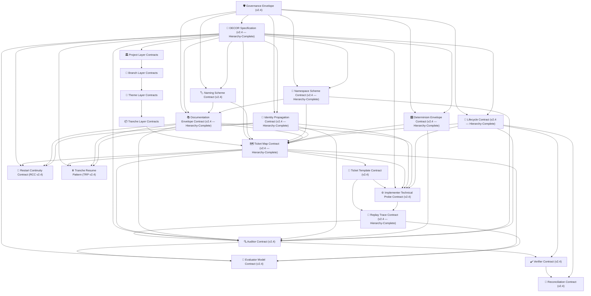

# **📚 Fugue Contract Suite Index (v2.4 — Hierarchy‑Complete)**  
**Status:** Authoritative  
**Governance Authority:** Curator  
**Scope:** All governed contracts required for deterministic orchestration  
**Ordering:** By dependency, governance authority, and lifecycle relevance  

---

# **0. Root Governance Substrate**

## **0.1 Governance Envelope Contract (v2.4)**
**Purpose:** Defines global governance posture, invariants, persona boundaries, lifecycle safety, hierarchy safety, and drift rules.  
**Upstream of:** All other contracts.  
**Hierarchy:** Project → Branch → Theme → Tranche.

---

# **1. Structural Contracts (Method Grammar)**

## **1.1 DECOR Specification Contract (v2.4 — Hierarchy‑Complete)**
**Purpose:** Defines DECOR at Project, Branch, Theme, and Tranche levels; governs invariants, constraints, identity, naming, namespace, and persona routing.  
**Upstream of:** Ticket Map, Lifecycle, Determinism, Documentation, Identity, Namespace.

## **1.2 Lifecycle Contract (v2.4 — Hierarchy‑Complete)**
**Purpose:** Defines the deterministic lifecycle across Project → Branch → Theme → Tranche; governs transitions, persona activation, and closure.  
**Depends on:** Governance Envelope, DECOR.

## **1.3 Identity Propagation Contract (v2.4 — Hierarchy‑Complete)**
**Purpose:** Defines identity lineage and propagation across all hierarchy layers and lifecycle phases.  
**Depends on:** Governance Envelope, DECOR.

## **1.4 Naming Scheme Contract (v2.4)**
**Purpose:** Defines deterministic naming rules for all governed artefacts across all hierarchy layers.  
**Depends on:** DECOR.

## **1.5 Namespace Scheme Contract (v2.4 — Hierarchy‑Complete)**
**Purpose:** Defines governed folder structure for Project, Branch, Theme, Tranche, and all governed artefacts.  
**Depends on:** Naming Scheme, DECOR.

## **1.6 Documentation Envelope Contract (v2.4 — Hierarchy‑Complete)**
**Purpose:** Defines documentation namespaces, persona authorship, metadata routing, and drift classification.  
**Depends on:** DECOR, Naming, Namespace.

## **1.7 Determinism Envelope Contract (v2.4 — Hierarchy‑Complete)**
**Purpose:** Defines deterministic ordering, evaluator behaviour, metadata propagation, identity propagation, and replay determinism across all hierarchy layers.  
**Depends on:** DECOR, Identity, Namespace, Documentation.

---

# **2. Hierarchy Contracts (Governance Layers)**

## **2.1 Project Contract Set**
- Project DECOR  
- Project Ticket Map  
- Project Governance Envelope  
- Project Bootstrap Rules  

**Depends on:** All structural contracts.

## **2.2 Branch Contract Set**
- Branch DECOR  
- Branch Ticket Map  
- Branch Governance Envelope  
- Branch Bootstrap Rules  

**Depends on:** Project layer.

## **2.3 Theme Contract Set**
- Theme DECOR  
- Theme Ticket Map  
- Theme Governance Envelope  
- Theme Bootstrap Rules  

**Depends on:** Branch layer.

## **2.4 Tranche Contract Set**
- Tranche DECOR  
- Tranche Ticket Map  
- Tranche Lifecycle  
- Tranche Governance Envelope  

**Depends on:** Theme layer.

---

# **3. Execution Contracts (Operational Machinery)**

## **3.1 Ticket Map Contract (v2.4 — Hierarchy‑Complete)**
**Purpose:** Defines deterministic ticket decomposition, sequencing, persona routing, metadata propagation, and hierarchy‑aligned execution.  
**Depends on:** DECOR, Naming, Namespace, Identity, Determinism.

## **3.2 Ticket Template Contract (v2.4)**
**Purpose:** Defines the canonical structure of a governed ticket.  
**Depends on:** Ticket Map, DECOR.

## **3.3 Replay Trace Contract (v2.4 — Hierarchy‑Complete)**
**Purpose:** Defines deterministic replay structure, evaluator metadata, identity lineage, and state transitions.  
**Depends on:** Determinism, Identity, Namespace, Lifecycle.

---

# **4. Runtime Contracts (Verification + Reconciliation)**

## **4.1 Auditor Contract (v2.4)**
**Purpose:** Defines drift classification, metadata validation, identity validation, namespace validation, and reconciliation rules.  
**Depends on:** DECOR, Ticket Map, Documentation Envelope, Determinism.

## **4.2 Verifier Contract (v2.4)**
**Purpose:** Defines final validation rules for closure, reconciliation, and governance alignment.  
**Depends on:** Auditor, Replay Trace, Lifecycle.

## **4.3 Reconciliation Contract (v2.4)**
**Purpose:** Defines rules for producing Reconciled DECOR and reconciled artefacts.  
**Depends on:** Auditor, Verifier, DECOR.

---

# **5. Continuity Contracts**

## **5.1 Restart Continuity Contract (RCC) (v2.4)**
**Purpose:** Defines deterministic restart rules for resuming a project, branch, theme, or tranche after time away.  
**Depends on:** DECOR, Ticket Map, Documentation Envelope.

## **5.2 Tranche Resume Pattern (TRP) (v2.4)**
**Purpose:** Defines deterministic resume rules for continuing a paused tranche mid‑execution.  
**Depends on:** DECOR, Ticket Map, Documentation Envelope.

---

# **6. Contract Dependency Graph (v2.4)**  

---

