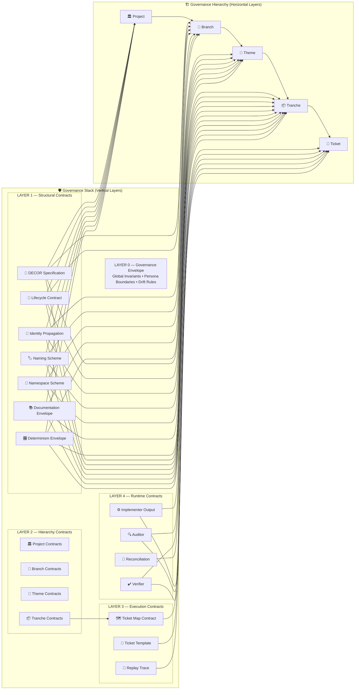

# **Fugue v2.4 — Governance Stack + Hierarchy Hybrid Diagram**



---

# **How to Read the Hybrid Diagram**

## **1. Left side = Governance Stack (vertical)**
This is the **method architecture**:

- Layer 0 → Governance Envelope  
- Layer 1 → Structural Contracts  
- Layer 2 → Hierarchy Contracts  
- Layer 3 → Execution Contracts  
- Layer 4 → Runtime Contracts  

This is the **“what governs the system”** axis.

---

## **2. Right side = Governance Hierarchy (horizontal)**
This is the **governed object hierarchy**:

```
Project → Branch → Theme → Tranche → Ticket
```

This is the **“what is being governed”** axis.

---

## **3. Cross‑links = Contract Applicability**
These show:

- which contracts apply at which hierarchy layer  
- how DECOR propagates downward  
- how runtime contracts apply only at Tranche + Ticket  
- how structural contracts apply everywhere  
- how execution contracts apply from Tranche downward  

This is the **“how governance flows”** axis.

---
