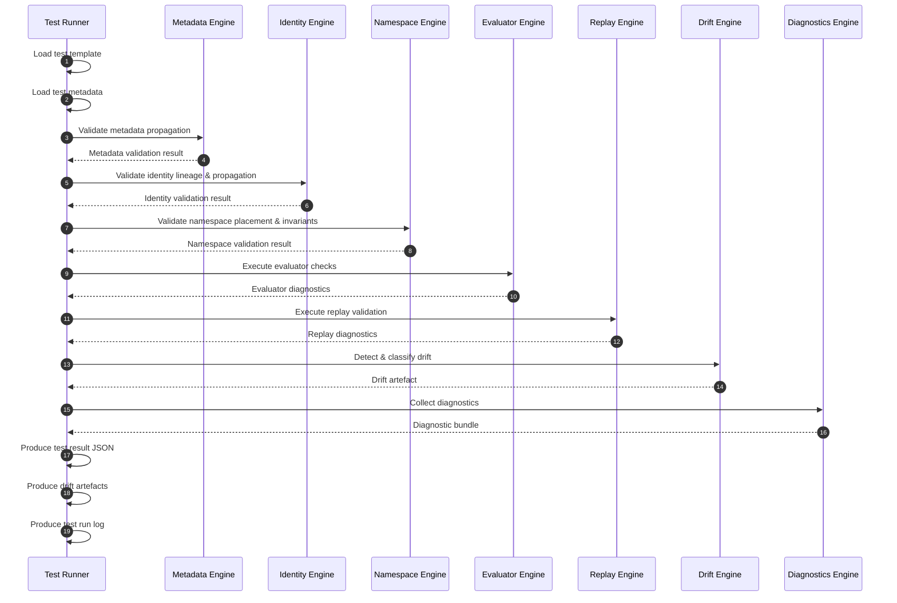

# **test-engine-sequence-diagram.md (v2.4)**  
**Test Execution Engine — Sequence Diagram (v2.4)**  
Version: 2.4  
Status: Active  
Authority: Test Engine Contract (v2.4)  
Lifecycle Phase: Verification  
Persona: Auditor → Verifier  

---

## 0. Metadata

```yaml
metadata:
  diagram-id: "test-engine-sequence-diagram"
  version: "2.4"
  authoritative: true

  applies-to:
    - test-execution-engine
    - test-runner
    - evaluator-engine
    - replay-engine
    - metadata-engine
    - identity-engine
    - namespace-engine
    - drift-engine
    - diagnostics-engine

  naming-scheme: "v2.4"
  namespace-scheme: "v2.4"
  identity-propagation: "v2.4"

  lifecycle-phase: "verification"
  persona: "auditor|verifier"

  last-updated: "<YYYY-MM-DD>"
```

---

## 1. Purpose

This diagram provides the **deterministic execution flow** of the Test Execution Engine (TEE) during Phase 4 — Verification.  
It is required by:

- Test Engine Contract  
- Test Suite Contract  
- Determinism Envelope Contract  
- Replay Trace Contract  
- Evaluator Contract  
- Identity & Namespace Contracts  

---

## 2. Sequence Diagram (Mermaid)



---

## 3. Determinism Notes

- Ordering MUST match the diagram exactly  
- No component may reorder transitions  
- No component may infer missing metadata  
- No component may regenerate identity  

---

## 4. Governance Notes

- Persona: Auditor → Verifier  
- Lifecycle: Verification only  
- All engines operate under strict envelope governance  

---
