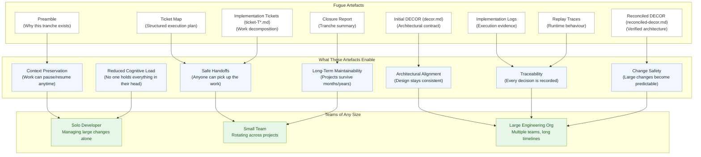

# **The Advantages of the Fugue Method**  
Version: 2.4
### *Why Fugue's structure and artefacts benefit engineering teams of any size*

Fugue is a methodology designed to make AI‑assisted engineering **predictable**, **governed**, and **maintainable** — whether you’re a single developer managing a large change, or a multi‑team organisation working across multiple projects over months and years.

This document explains the practical advantages of Fugue and the role of its artefacts in real engineering workflows.

---

# **1. Fugue Helps Teams of Any Size Stay Organised**

Whether you’re:

- **one developer** juggling a large, multi‑surface change  
- **a small team** rotating across projects  
- **a large engineering organisation** with long‑running initiatives  

…Fugue gives you a structured, repeatable way to manage complexity.

### **Why this matters:**  
Software work rarely happens in a straight line.  
People switch projects, priorities shift, and context gets lost.  
Fugue’s artefacts preserve the “why” and “how” of every decision.

---

# **2. Fugue’s Artefacts Create a Durable Memory of the Work**

Fugue produces a set of governed artefacts that act as a **permanent, navigable record** of the system’s evolution:

- **Preamble** — why the tranche exists  
- **Initial DECOR (decor.md)** — what the architecture must be  
- **Ticket Map** — how the work is decomposed  
- **Implementation Tickets (ticket-T*.md)** — what was actually executed  
- **Implementation Logs** — how it was built  
- **Replay Traces** — how it behaved  
- **Reconciled DECOR** — what the architecture became  
- **Closure Report** — how the tranche ended  

### **Why this matters:**  
These artefacts make it possible to:

- pause a project for months  
- hand it to another engineer  
- resume without losing context  
- audit decisions  
- understand architectural intent  
- trace implementation back to requirements  

This is invaluable for long‑running or multi‑team work.

---

# **3. Fugue Reduces Cognitive Load**

Most engineering pain comes from **context switching**:

- “What were we doing here?”  
- “Why was this decision made?”  
- “What’s the current architecture?”  
- “What’s left to do?”  
- “What’s the risk surface?”  

Fugue eliminates this by:

- isolating phases  
- isolating personas  
- producing deterministic artefacts  
- keeping conversations small and focused  

### **For a solo developer:**  
You don’t need to hold the entire system in your head.

### **For a team:**  
Anyone can pick up where someone else left off.

---

# **4. Fugue Makes Large Changes Safe**

Large changes are risky because:

- architecture drifts  
- implementation diverges  
- requirements shift  
- context gets lost  
- verification is inconsistent  

Fugue mitigates these risks through:

- **Initial DECOR (decor.md)** (architectural contract)  
- **Ticket Map** (structured execution plan)  
- **Implementer logs + traces** (runtime evidence)  
- **Auditor reconciliation** (final verification)  

### **Why this matters:**  
You can make large, multi‑module changes with confidence — even as a single developer.

---

# **5. Fugue Enables Predictable Collaboration**

Teams often struggle with:

- inconsistent design decisions  
- unclear ownership  
- mismatched expectations  
- undocumented reasoning  
- unpredictable implementation quality  

Fugue solves this by:

- giving each persona a clear role  
- producing artefacts that encode decisions  
- enforcing deterministic workflows  
- keeping humans in the loop at key points  

### **Outcome:**  
Teams collaborate without stepping on each other’s toes — even across months or years.

---

# **6. Fugue Supports Long‑Term Maintainability**

Most AI‑assisted development methods break down over time:

- super‑prompts drift  
- specs become stale  
- context windows overflow  
- conversations lose coherence  
- architectural intent gets lost  

Fugue avoids this because:

- each tranche is self‑contained  
- artefacts are durable  
- personas don’t drift  
- conversations stay small  
- architecture is always reconciled  

### **Result:**  
You can return to a project after 6 months and understand exactly:

- what happened  
- why it happened  
- what the architecture is  
- what remains to be done  

This is a huge advantage for real‑world engineering.

---

# **7. Fugue Scales With the Team**

Fugue works for:

### **1 developer**  
You get structure, clarity, and safety — without needing a team.

### **A small team**  
You get predictable handoffs and shared understanding.

### **A large organisation**  
You get governance, auditability, and reproducible engineering.

### **Distributed teams**  
You get a shared language and artefact trail.

### **Teams rotating across projects**  
You get continuity and context preservation.

---

# **8. Summary: Why Fugue’s Artefacts Matter**

Fugue’s artefacts are not bureaucracy — they are **engineering assets**.

They:

- preserve intent  
- preserve architecture  
- preserve decisions  
- preserve implementation evidence  
- preserve verification  
- preserve continuity  

This makes Fugue uniquely suited for:

- long‑running projects  
- multi‑team environments  
- complex architectural work  
- governance‑sensitive systems  
- large changes managed by a single developer  

Fugue gives teams of any size the ability to work with **clarity**, **confidence**, and **continuity**.

---
