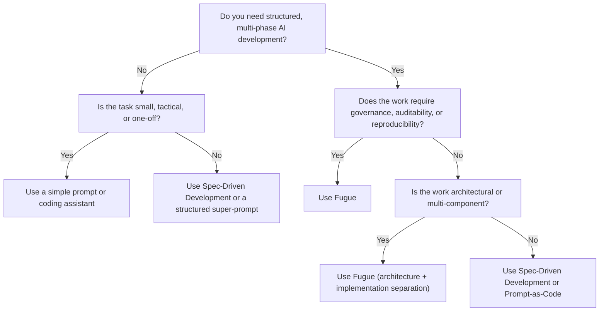

# **When NOT to Use Fugue**  
Version: 2.4
### *A decision tree and guidance for choosing the right AI‑assisted development method*

Fugue is powerful — but it is not universal.  
It is designed for **structured, governed, multi‑phase, multi‑persona AI‑assisted engineering**.  
Not every task needs that level of orchestration.

This document helps you decide **when Fugue is appropriate**, and more importantly, **when it isn’t**.

---

# **1. Decision Tree: Should You Use Fugue?**

---

# **2. When Fugue Is NOT the Right Tool**

Fugue is *not* ideal for:

---

## **2.1 Small, tactical, or one‑off tasks**  
Examples:

- “Write a small function.”  
- “Refactor this file.”  
- “Generate a test suite.”  
- “Explain this code.”  
- “Draft a quick design idea.”

**Why Fugue isn’t needed:**  
The overhead of personas, phases, and artefacts outweighs the benefit.

**Use instead:**  
- A coding assistant  
- A single‑persona prompt  
- A short spec‑driven prompt  

---

## **2.2 Tasks with no architectural or governance implications**  
Examples:

- Updating documentation  
- Writing a script  
- Creating a small utility  
- Performing a code review  
- Generating examples or boilerplate  

**Why Fugue isn’t needed:**  
Fugue’s DECOR and Ticket Map machinery is overkill.

**Use instead:**  
- Spec‑Driven Development  
- Prompt‑as‑Code  
- A structured super‑prompt  

---

## **2.3 Exploratory or creative ideation**  
Examples:

- Brainstorming  
- Prototyping  
- Generating alternatives  
- Exploring design spaces  

**Why Fugue isn’t needed:**  
Fugue is deterministic and governed — not exploratory.

**Use instead:**  
- Freeform prompting  
- Agent‑based ideation  
- RAG‑augmented exploration  

---

## **2.4 Highly time‑sensitive tasks**  
Examples:

- “I need this in 10 minutes.”  
- “We just need a quick draft.”  

**Why Fugue isn’t needed:**  
Fugue trades speed for structure and correctness.

**Use instead:**  
- A single‑persona assistant  
- A targeted prompt  

---

## **2.5 Work that will not be maintained or reused**  
Examples:

- Throwaway prototypes  
- One‑off scripts  
- Temporary experiments  

**Why Fugue isn’t needed:**  
Fugue’s value compounds over time — not in disposable work.

---

# **3. When Fugue *Is* the Right Tool**

Use Fugue when:

---

## **3.1 The work spans multiple phases**  
If you need:

- intent  
- architecture  
- implementation  
- verification  
- closure  

…Fugue is ideal.

---

## **3.2 The work requires governance or auditability**  
If you need:

- traceability  
- reproducibility  
- compliance  
- deterministic artefacts  

…Fugue is the right choice.

---

## **3.3 The work is multi‑component or multi‑persona**  
If the system has:

- multiple modules  
- multiple architectural surfaces  
- multiple implementation surfaces  

…Fugue’s persona isolation prevents drift.

---

## **3.4 The work is long‑running**  
If the project spans:

- weeks  
- months  
- multiple tranches  

…Fugue’s structure keeps the system coherent.

---

# **4. Comparison to Other Methods**

| Method | Best For | Not Good For | Fugue’s Position |
|--------|----------|--------------|------------------|
| **Spec‑Driven Development** | Medium‑sized tasks with clear specs | Long‑running or multi‑phase work | Fugue extends SDD with personas + phases |
| **Super‑Prompts** | Quick tasks | Anything requiring governance | Fugue replaces super‑prompts with structured phases |
| **Prompt‑as‑Code** | Reusable prompt patterns | Complex lifecycle work | Fugue uses prompts as persona seeders, not workflows |
| **Agent‑Based Systems** | Exploration | Deterministic engineering | Fugue is governed, not autonomous |
| **Coding Assistants** | Small tasks | Architecture or governance | Fugue is a full methodology |

---

# **5. Summary: Fugue Is a Methodology, Not a Hammer**

Fugue is designed for:

- structured  
- governed  
- multi‑phase  
- multi‑persona  
- reproducible  
- long‑running  
- architecture‑heavy  

…AI‑assisted engineering.

It is **not** designed for:

- quick tasks  
- one‑offs  
- throwaway work  
- pure ideation  
- small scripts  
- tactical coding  

Using Fugue only where it adds value is a sign of maturity — and it ensures the methodology remains sharp, respected, and effective.

---
