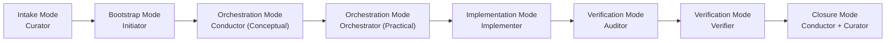

# **Fugue Modes (v2.4)**  
**Operational Persona Mapping for Practical Execution**  
Version: 2.4  
Status: Active

---

# Overview

**Fugue Modes** define the *operational instantiation* of Fugue’s conceptual personas during real execution of a tranche.

They translate the **conceptual persona set**:

- Curator  
- Conductor (Conceptual Mode)  
- Methodologist  
- Architect  
- Initiator  
- Orchestrator  
- Implementer  
- Auditor  
- Verifier  

into a set of **practical modes** that align with:

- the **six‑phase Fugue lifecycle**  
- the **DECOR lifecycle (v2.4)**  
- the **persona isolation rules**  
- the **four‑conversation orchestration model**  
- the **governance envelopes**  
- the **drift model (v2.4)**  

Conceptual personas define *what roles exist*.  
Fugue Modes define *where and when they operate*.

---

# 🎼 **Fugue Lifecycle (v2.4)**

Fugue now operates across **six deterministic phases**:

1. **Intake Mode** — Curator defines intent  
2. **Bootstrap Mode** — Initiator prepares the tranche  
3. **Orchestration Mode** — Conductor (Conceptual) + Orchestrator (Practical)  
4. **Implementation Mode** — Implementer executes tickets  
5. **Verification Mode** — Auditor detects drift → Verifier validates corrections  
6. **Closure Mode** — Conductor + Curator approve closure  

Each phase has strict persona boundaries and deterministic artefacts.

---

# 🎼 **1. Intake Mode**  
**(Curator → Initiator)**  
**Lives in:** Any AI acting as the tranche intake engine (e.g., Copilot Chat)

Intake Mode is responsible for:

- defining the tranche mission  
- defining the tranche boundaries  
- defining the tranche governance posture  
- defining acceptance criteria  
- defining structural intent  
- producing the tranche preamble  
- clarifying intent when requested  

### Responsibilities
- Produce the tranche preamble  
- Refine the preamble when ambiguities are surfaced  
- Provide governance posture  
- Provide acceptance criteria  
- Provide identity propagation rules  

### Notes
Intake Mode:

- **does not** derive DECOR  
- **does not** generate tickets  
- **does not** perform governance enforcement  
- **does not** participate in reconciliation  

It defines intent; others execute it.

---

# 🎼 **2. Bootstrap Mode**  
**(Initiator)**  
**Lives in:** Any AI preparing the tranche workspace

Bootstrap Mode is responsible for:

- creating the tranche folder structure  
- generating the documentation envelope  
- generating the DECOR envelope  
- generating the Ticket Map skeleton  
- registering the tranche  
- validating the preamble  
- ensuring deterministic bootstrap state  
- handing off to the Orchestrator  

### Responsibilities
- Create tranche folder structure  
- Create documentation envelope  
- Create DECOR envelope  
- Create Ticket Map skeleton  
- Validate templates  
- Validate metadata  
- Validate preamble completeness  
- Register the tranche  

### Notes
Bootstrap Mode:

- **does not** generate tickets  
- **does not** derive DECOR  
- **does not** orchestrate  
- **does not** implement  
- **does not** reconcile  

It prepares the workspace; others use it.

---

# 🎼 **3. Orchestration Mode**  
**(Conductor (Conceptual) + Orchestrator (Practical))**  
**Lives in:** Any AI acting as the tranche conductor (e.g., Copilot Chat)

Orchestration Mode is responsible for:

- interpreting the preamble  
- coordinating the lifecycle  
- generating conceptual Ticket Maps  
- generating implementation Ticket Maps  
- enforcing persona boundaries  
- enforcing governance envelopes  
- enforcing DECOR metadata  
- coordinating Architect Fill Phase  
- coordinating Implementer clarifications  
- coordinating reconciliation  
- producing tranche‑level logs  
- preparing closure artefacts  

### Responsibilities (Conceptual Conductor)
- Interpret methodology‑refinement preambles  
- Generate conceptual Ticket Maps  
- Coordinate Methodologist + Architect  
- Enforce conceptual governance envelopes  
- Surface conceptual contradictions  
- Prepare conceptual artefacts for Curator approval  

### Responsibilities (Practical Orchestrator)
- Interpret implementation preambles  
- Generate implementation Ticket Maps  
- Enforce DECOR metadata  
- Enforce invariants  
- Enforce governance envelopes  
- Manage clarifications  
- Integrate surfaced technical truths  
- Initiate Architect Fill Phase  
- Coordinate reconciliation  
- Generate epilogue tickets  

### Notes
Orchestration Mode:

- **does not** implement  
- **does not** derive DECOR (conceptual Conductor may request derivation)  
- **does not** reconcile (Auditor + Verifier do)  

It orchestrates; others execute.

---

# 🎼 **4. Implementation Mode**  
**(Implementer)**  
**Lives in:** Any implementing AI (e.g., GitHub Copilot, Cursor, Codeium)

Implementation Mode is responsible for:

- implementing tickets  
- producing code  
- producing tests  
- producing implementation logs  
- producing replay traces  
- producing implementation documentation  
- surfacing technical truths  
- respecting DECOR metadata  
- respecting invariants  
- respecting governance envelopes  

### Responsibilities
- Implement tickets exactly as written  
- Produce deterministic code  
- Produce deterministic tests  
- Produce deterministic replay traces  
- Produce implementation logs  
- Produce implementation documentation  
- Surface feasibility issues  
- Surface contradictions  
- Surface determinism risks  

### Notes
Implementation Mode:

- **does not** derive DECOR  
- **does not** modify DECOR  
- **does not** orchestrate  
- **does not** reconcile  

It executes; others validate.

---

# 🎼 **5. Verification Mode**  
**(Auditor → Verifier)**  
**Lives in:** Any AI acting as the validation engine (e.g., Copilot Chat)

Verification Mode is responsible for:

- validating implementation  
- validating documentation  
- validating tests  
- validating determinism  
- validating DECOR alignment  
- validating governance alignment  
- detecting drift  
- classifying drift  
- validating drift corrections  
- validating epilogue tickets  
- validating reconciled DECOR  
- producing closure artefacts  

### Responsibilities (Auditor)
- Validate implementation  
- Validate documentation  
- Validate tests  
- Validate determinism  
- Validate DECOR alignment  
- Validate governance alignment  
- Detect drift  
- Classify drift  
- Produce drift reports  

### Responsibilities (Verifier)
- Validate drift corrections  
- Validate epilogue tickets  
- Validate reconciled DECOR  
- Validate reconciled documentation  
- Validate reconciled tests  
- Validate reconciled determinism  
- Validate persona boundary compliance  
- Validate governance compliance  
- Produce verification report  
- Approve tranche closure (technical approval)  

### Notes
Verification Mode:

- **does not** implement  
- **does not** orchestrate  
- **does not** derive DECOR  

It validates; others execute.

---

# 🎼 **6. Closure Mode**  
**(Conductor (Conceptual) + Curator)**  
**Lives in:** Any AI acting as governance authority

Closure Mode is responsible for:

- reviewing verification reports  
- reviewing reconciled DECOR  
- reviewing reconciled documentation  
- reviewing reconciled tests  
- approving tranche closure  

### Responsibilities
- Conductor validates conceptual alignment  
- Curator validates governance alignment  
- Curator approves closure  

### Notes
Closure Mode:

- **does not** implement  
- **does not** orchestrate  
- **does not** reconcile  

It approves; others validate.

---

# 🎼 **Persona → Mode Mapping (v2.4)**

| Conceptual Persona | Practical Mode(s) | Notes |
|--------------------|-------------------|-------|
| **Curator** | Intake, Closure | Defines governance posture |
| **Conductor (Conceptual)** | Orchestration, Closure | Conceptual orchestration |
| **Methodologist** | None | Drafting only |
| **Architect** | Orchestration, Verification | Structural reasoning |
| **Initiator** | Bootstrap | Tranche setup |
| **Orchestrator** | Orchestration | Implementation orchestration |
| **Implementer** | Implementation | Execution only |
| **Auditor** | Verification | Drift detection |
| **Verifier** | Verification | Final validation |

---

# 🎼 **Conversation Mapping (v2.4)**

| Conversation | Active Mode(s) | Purpose |
|--------------|----------------|---------|
| **Intake Conversation** | Intake Mode | Preamble generation |
| **Bootstrap Conversation** | Bootstrap Mode | Tranche setup |
| **Orchestrator Conversation** | Orchestration Mode | DECOR, governance, lifecycle |
| **Implementer Conversations** | Implementation Mode | Ticket execution |
| **Verifier Conversation** | Verification Mode | Reconciliation & closure |

Each conversation maintains **strict persona isolation**.

---

# 🎼 **DECOR Lifecycle (v2.4)**

| Phase | Responsible Mode | Responsible Persona |
|-------|------------------|---------------------|
| **Derive Initial DECOR** | Orchestration | Architect |
| **Apply DECOR** | Implementation | Implementer |
| **Enforce DECOR metadata** | Orchestration | Orchestrator |
| **Update DECOR** | Orchestration | Architect |
| **Validate DECOR alignment** | Verification | Auditor |
| **Validate reconciled DECOR** | Verification | Verifier |
| **Approve DECOR changes** | Closure | Curator |

---

# 🎼 **Method A vs Method B (v2.4)**

### Method A — Product‑First  
- Curator defines product intent  
- Conductor (Conceptual) anchors DECOR  
- Architect derives DECOR from product intent  
- Implementer surfaces feasibility issues  
- Orchestrator enforces DECOR metadata  
- Auditor/Verifier validate alignment  

### Method B — Technical‑First  
- Implementer surfaces technical truths  
- Architect derives DECOR from technical evidence  
- Conductor (Conceptual) validates conceptual alignment  
- Orchestrator enforces DECOR metadata  
- Auditor/Verifier validate alignment  

Both methods use the same Fugue Modes.

---

# Lifecycle Diagram (v2.4)

# 🎼 **Summary**

Fugue Modes v2.4 provide the operational mapping required to execute Fugue deterministically across multiple AI substrates.

They ensure:

- strict persona isolation  
- deterministic lifecycle execution  
- stable conversation boundaries  
- consistent DECOR lifecycle  
- governance‑aligned orchestration  
- deterministic implementation  
- rigorous reconciliation  
- substrate‑agnostic execution  

They are the **operational backbone** of the Fugue Method.

---
